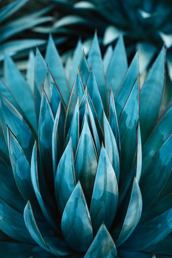
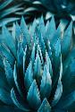
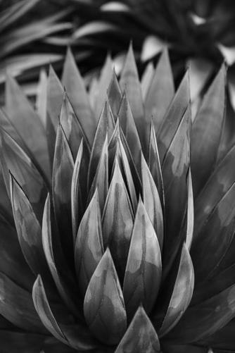
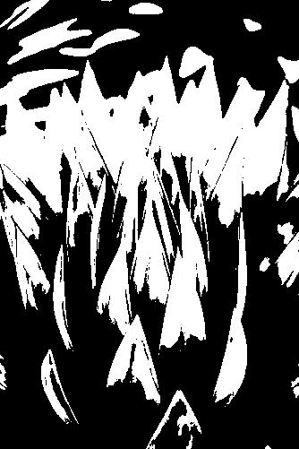
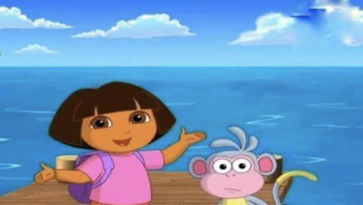
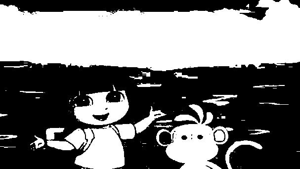
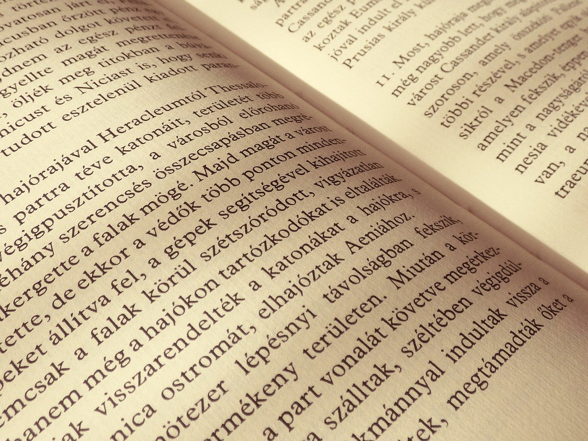
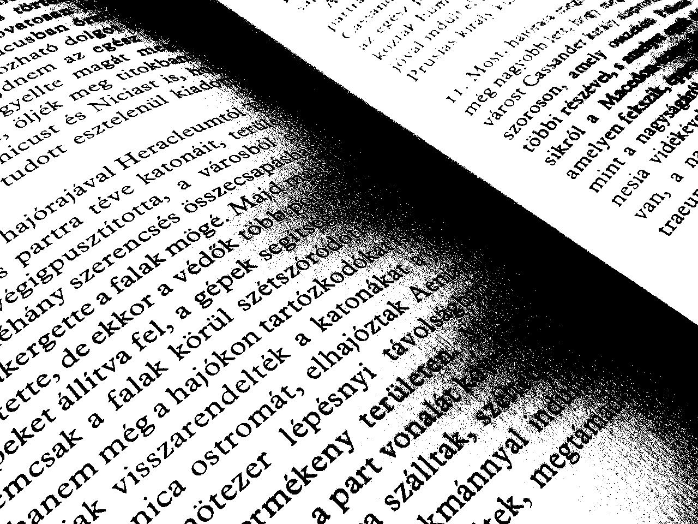
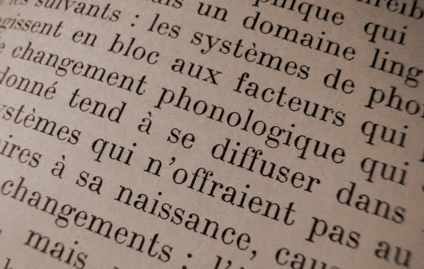
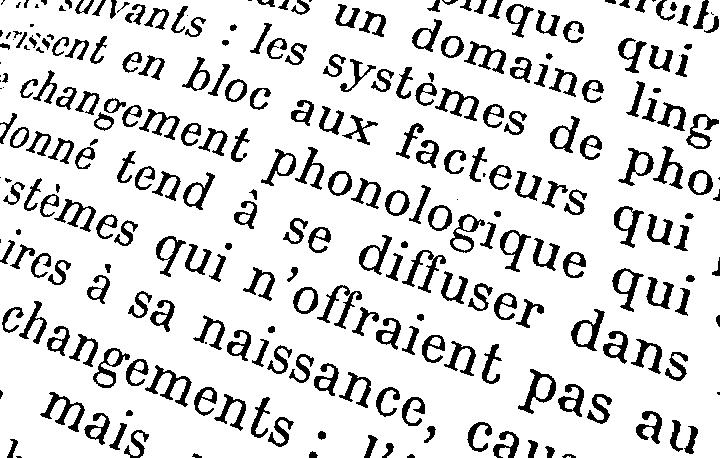

# Фильтрация изображений и морфологические операции

## Передискретизация

### NNResampling

Исходное изображение:

Интерполяция в 3 раза:

Децимация в 4 раза:

Увеличенное изображение осталось в хорошем качестве лишь с учетом того, что границы объекта стали менее четкими.

Качество сжатого изображения ухудшилось появились артефикаты : гладкие границы объекта стали пиксилизированы.

## Передискретизация изображения в K=M/N раз путём растяжения и последующего сжатия (в два прохода)

M=3, N=2. Увеличенное в 1.5 раз изображение

Передискретизация в 1 проход

## Приведение полноцветного изображения к полутоновому

формула Photoshop

## Приведение полутонового изображения к монохромному методом Отсу

### Фото

### Мультфильмы

 

### Текст

  

Данный метод плохо обрабатывает изображения с плавным переходом цветов, фотографии, мультипликационные изобраения, однако хорошо справляется с обработкой и выявлениям текста.
