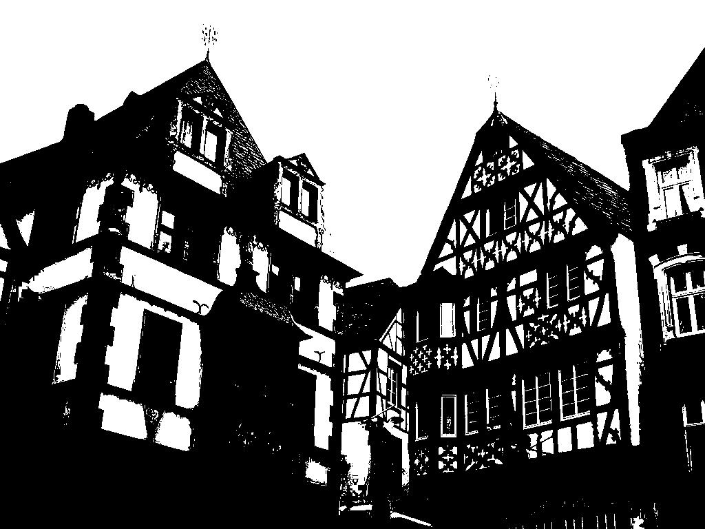
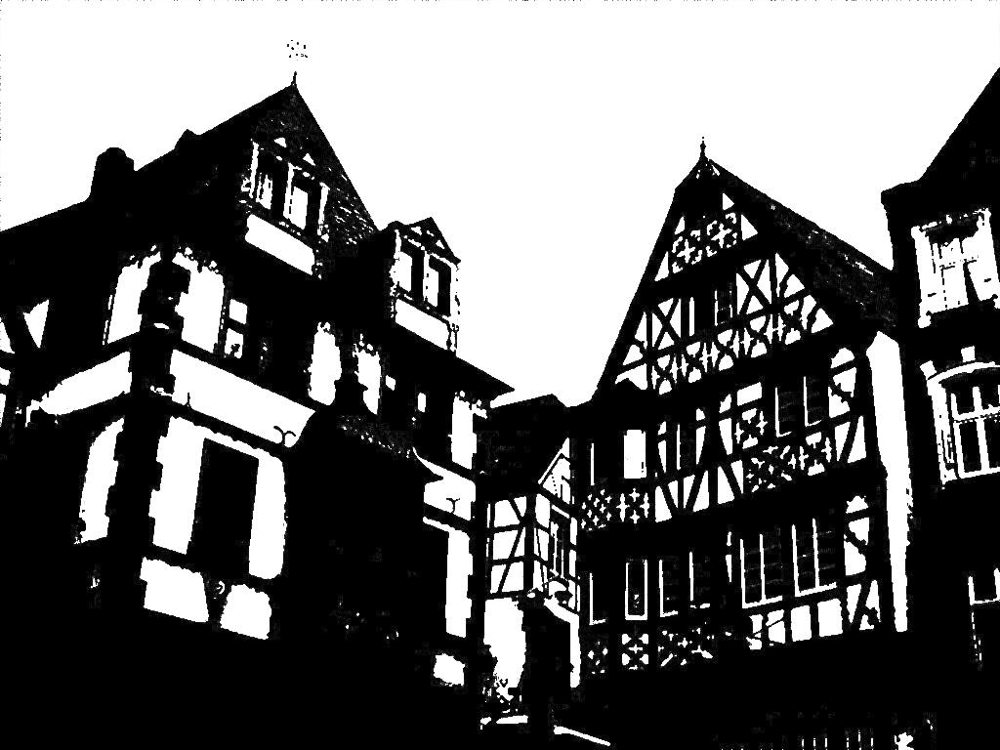
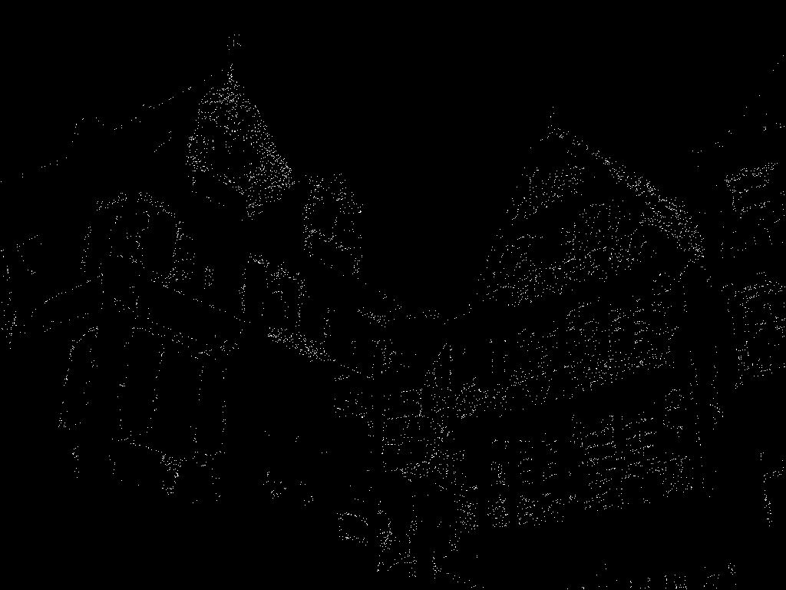
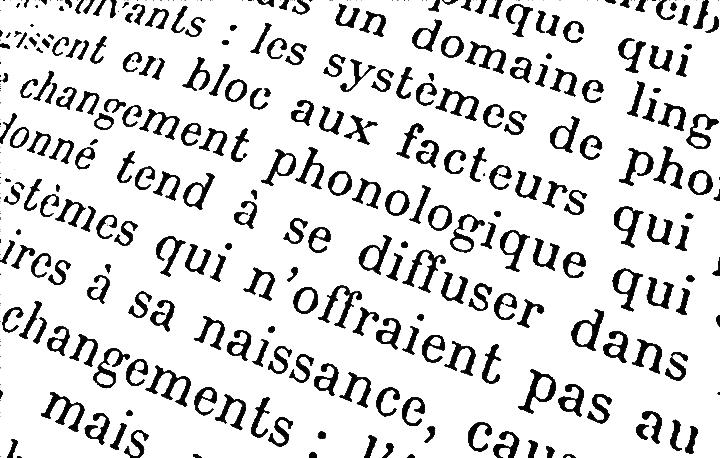
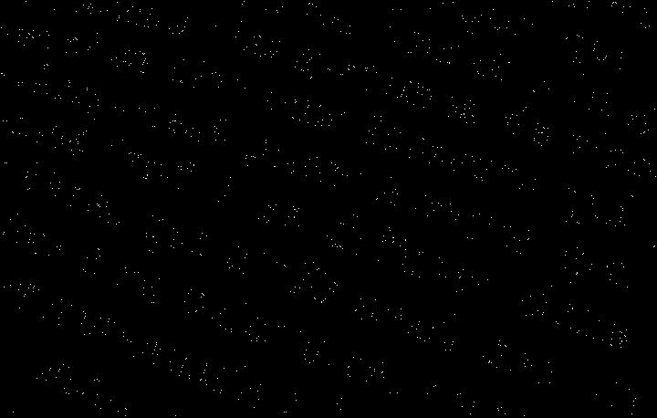
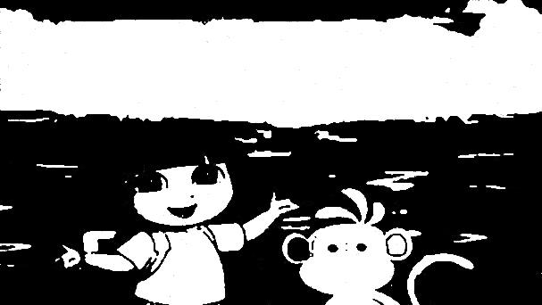
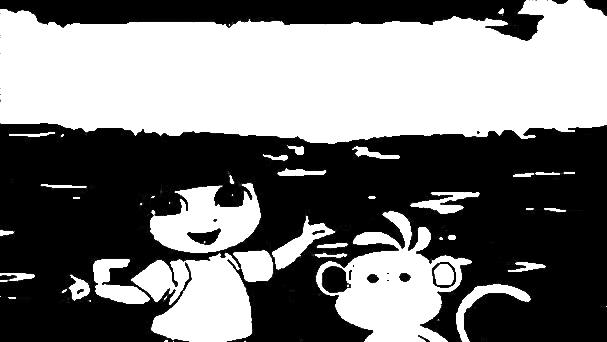
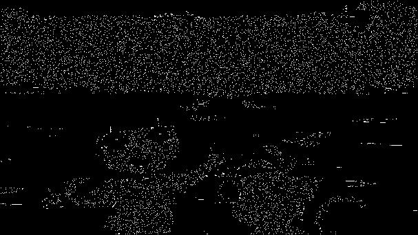

# Фильтрация изображений и морфологические операции

## Фильтрация медианным фильтром с ядром в виде холма (приоритет центра и соседей), в виде впадины (приоритет углов и соседей, в центре 1)

### Ядро в виде холма

|     |     |     |
| --- | --- | --- |
| 1   | 2   | 1   |
| 2   | 4   | 2   |
| 1   | 2   | 1   |

### Ядро в виде впадины

|     |     |     |
| --- | --- | --- |
| 4   | 2   | 4   |
| 3   | 1   | 3   |
| 4   | 2   | 4   |

### Исходное изображение

### Изображение с шумом и перцем

### Медианный фильтр с ядром в виде холма

### Медианный фильтр с ядром в виде впадины

Оба фильтра успещно избавились от большинства шума, не исказив исходный объект. Для данного изображения фильтр с ядром в виде впадины сработал лучше (Небо кажется более чистым).

### Разностное изображение

### Другие виды изображений

| Холм                                                      | Впадина                                                                | Разностное                                                          |
| --------------------------------------------------------- | ---------------------------------------------------------------------- | ------------------------------------------------------------------- |
|  |  |  |
|  |  |             |
