# Выделение контуров на изображении

## Оператор Шарра 3x3

$$
    G_{x} = \begin{pmatrix}
        3 & 0 & -3 \\
        10 & 0 & -10 \\
        3 & 0 & -3 \\
    \end{pmatrix} * A\text{ }\text{ }\text{ }\text{ }\text{ }\text{ }\text{ }

    G_{y} = \begin{pmatrix}
        3 & 10 & 3 \\
        0 & 0 & 0 \\
        -3 & -10 & -3 \\
    \end{pmatrix} * A
$$

## Формула градиента

$$
    G = |G_{x}| + |G_{y}|
$$

## El clasico

### Исходное изображение

### Полутоновое изображение

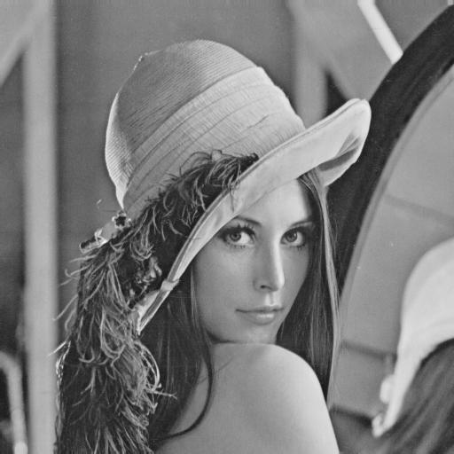

### Градиент по x

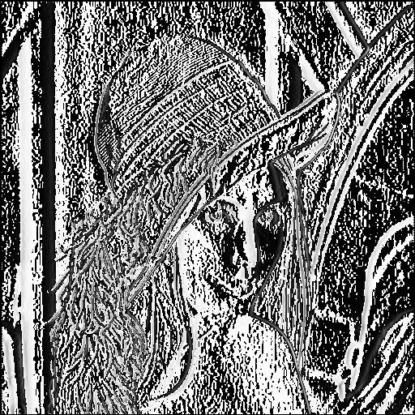

### Градиент по y

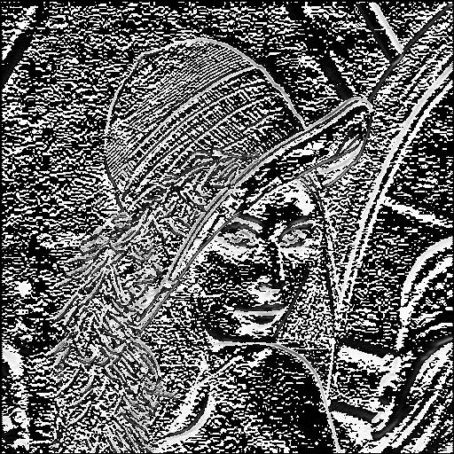

### Общий градиент с выделенными контурами

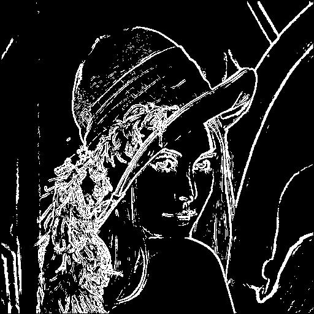

### Контуры изображения хорошо различимы в целом, алгоритм имеет небольшие сбои при обработки сложных деталей(волосы).

## Фото

### Исходное изображение

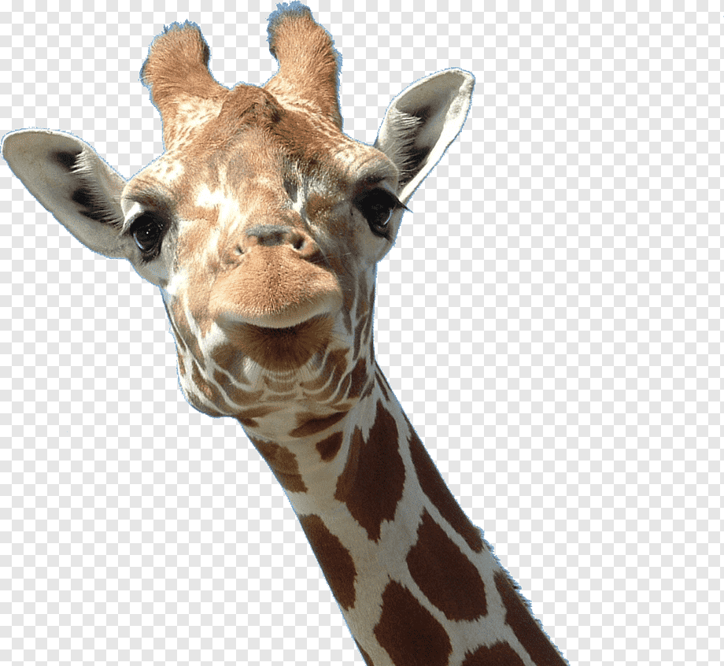

### Полутоновое изображение

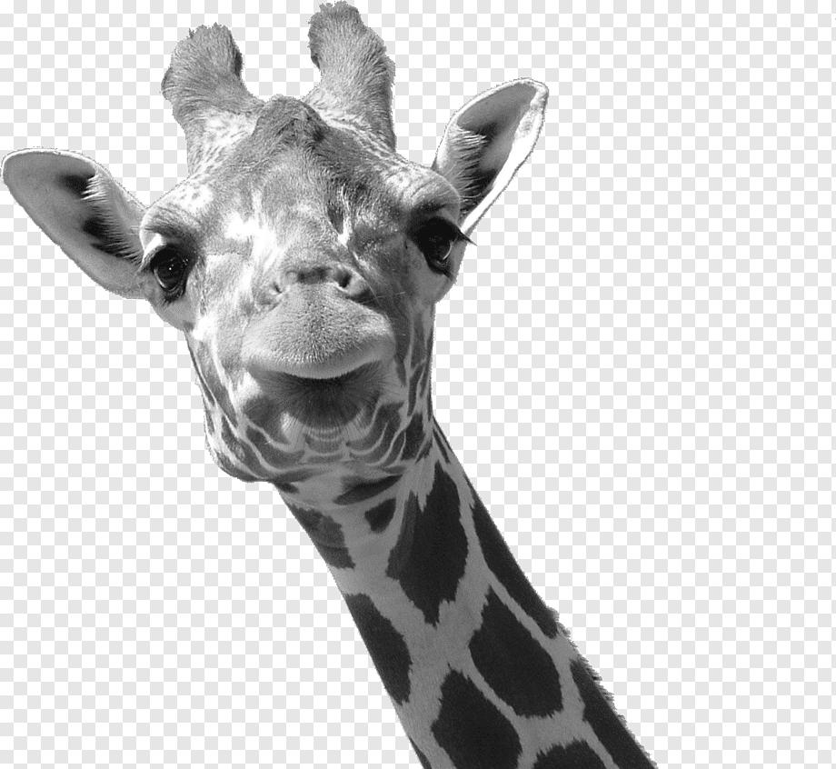

### Градиент по x

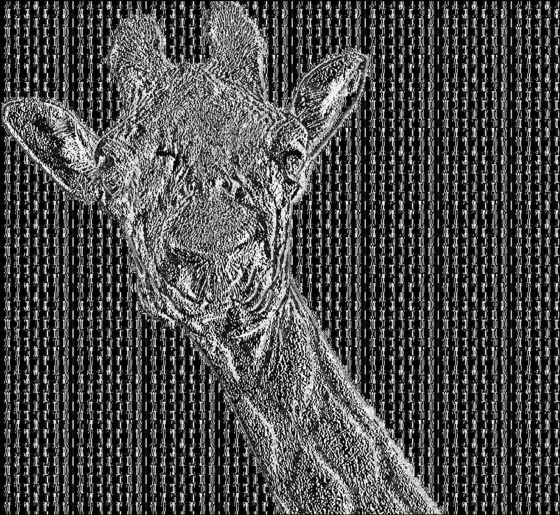

### Градиент по y

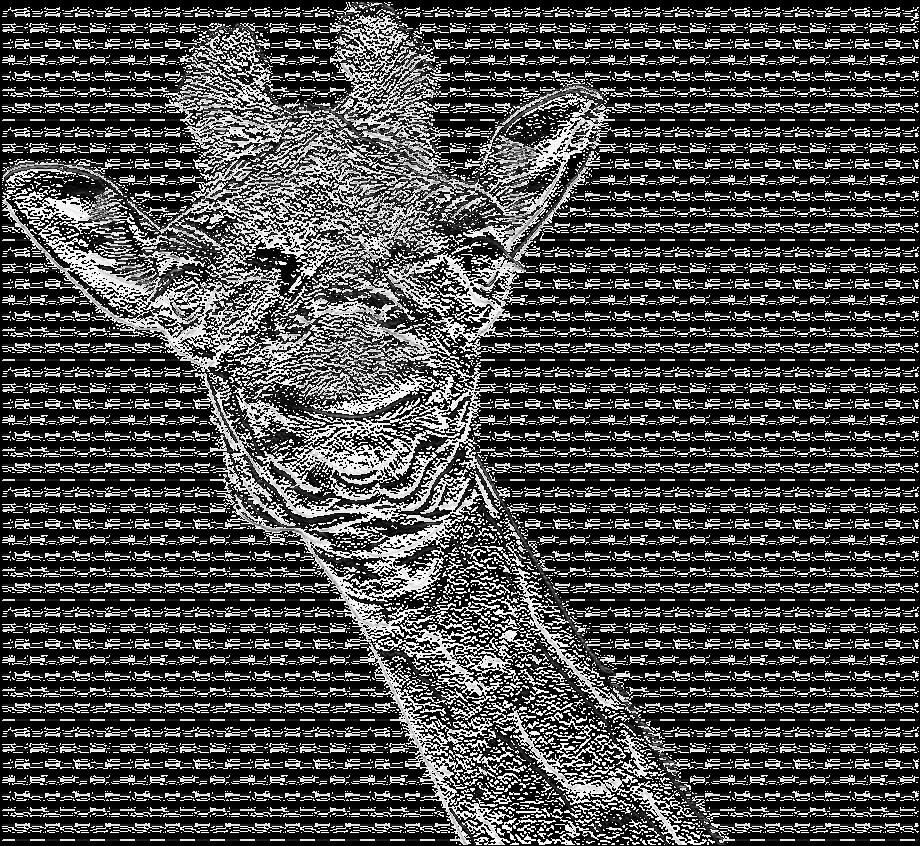

### Общий градиент с выделенными контурами

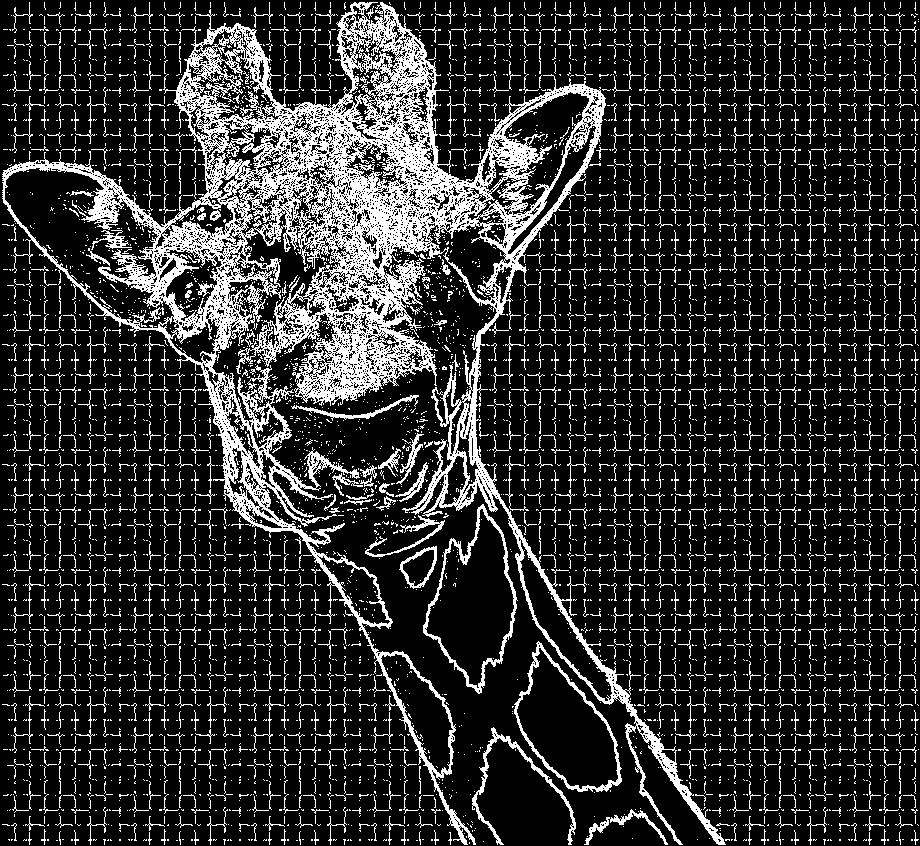

### Пятна жирафа выбраны четко однако другие детали алгоритм обработал плохо.

## Мультфильм

### Исходное изображение

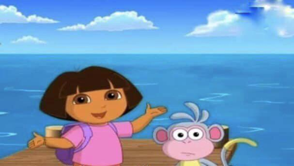

### Полутоновое изображение

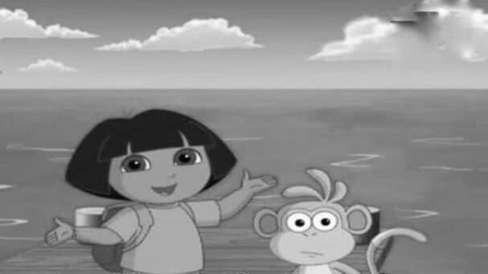

### Градиент по x

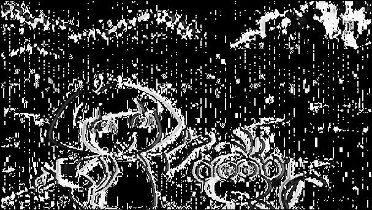

### Градиент по y

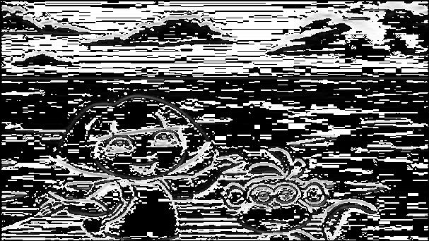

### Общий градиент с выделенными контурами

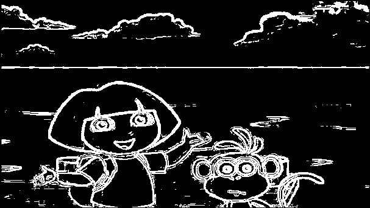

### Мильтипликационный снимок алгоритм обработал хорошо

## Текст

### Исходное изображение

### Полутоновое изображение

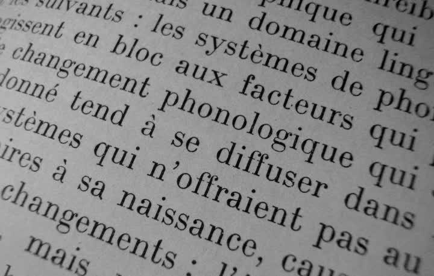

### Градиент по x

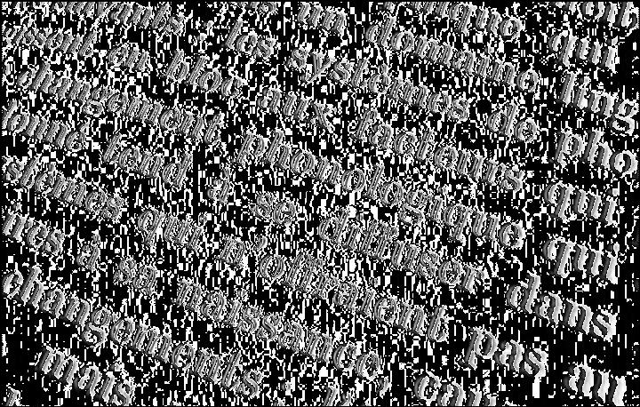

### Градиент по y

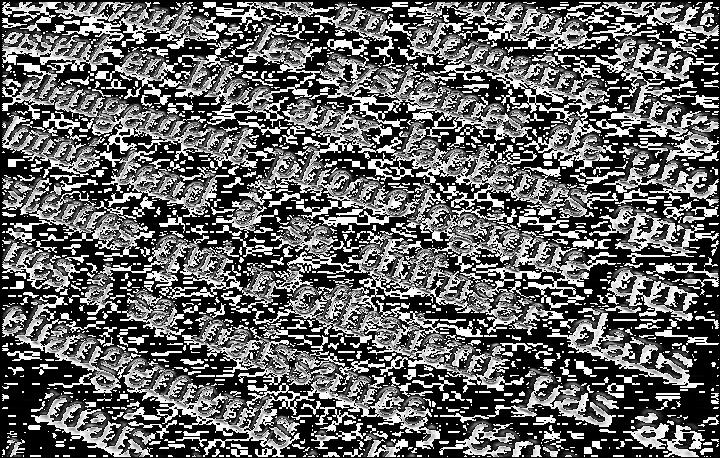

### Общий градиент с выделенными контурами

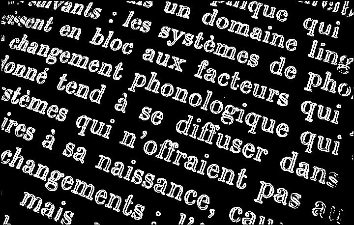

### Текст алгоритм обработал очень хорошо
