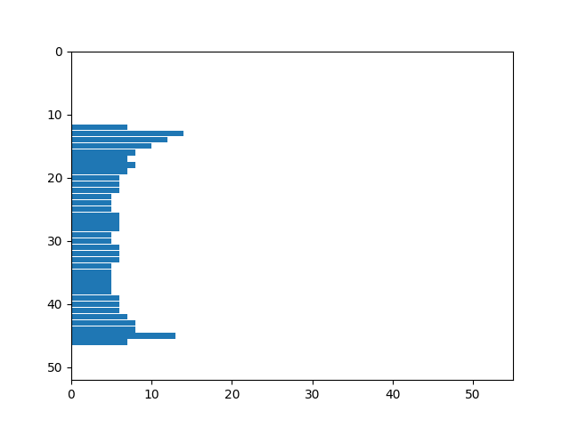
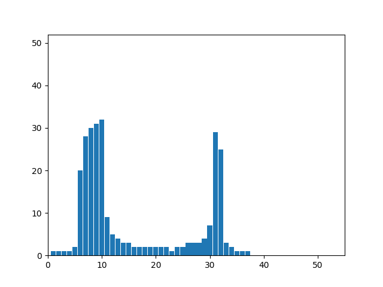

# Лабораторная работа №4. Выделение признаков символов

## Алфавит - португальский

## Профили и числовые признаки изображений

### Буква A

  

Признаки:

- Вес чёрного = 258.0
- Нормированный вес чёрного = 0.20476190476190476
- Центр масс = (19.65891472868217, 21.313953488372093)
- Нормированный центр масс = (0.5331118493909192, 0.597469220246238)
- Моменты инерции = (23017.56976744186, 15659.98449612403)
- Нормированные моменты инерции = (9.1303331088623, 6.211814556177719)

### Буква B

  

Признаки:

- Вес чёрного = 427.0
- Нормированный вес чёрного = 0.3935483870967742
- Центр масс = (16.4192037470726, 18.311475409836067)
- Нормированный центр масс = (0.5139734582357534, 0.5091610414657667)
- Моменты инерции = (48715.5737704918, 32733.962529274006)
- Нормированные моменты инерции = (22.285257900499452, 14.974365292440076)

### Буква C

  

Признаки:

- Вес чёрного = 238.0
- Нормированный вес чёрного = 0.22666666666666666
- Центр масс = (11.163865546218487, 17.235294117647058)
- Нормированный центр масс = (0.3504781222833961, 0.47750865051903113)
- Моменты инерции = (29334.82352941176, 19030.609243697476)
- Нормированные моменты инерции = (13.804622837370239, 8.955580820563519)

### Буква D

  

Признаки:

- Вес чёрного = 408.0
- Нормированный вес чёрного = 0.34285714285714286
- Центр масс = (17.933823529411764, 18.014705882352942)
- Нормированный центр масс = (0.5131461675579323, 0.5004325259515571)
- Моменты инерции = (49029.91176470589, 45695.213235294104)
- Нормированные моменты инерции = (20.59215109815451, 19.19160572670899)

### Буква E

  

Признаки:

- Вес чёрного = 320.0
- Нормированный вес чёрного = 0.31527093596059114
- Центр масс = (12.990625, 18.078125)
- Нормированный центр масс = (0.4282366071428571, 0.5022977941176471)
- Моменты инерции = (43603.046875, 16680.971874999996)
- Нормированные моменты инерции = (21.10505657066796, 8.074042533881896)

### Буква F

  

Признаки:

- Вес чёрного = 240.0
- Нормированный вес чёрного = 0.26373626373626374
- Центр масс = (10.791666666666666, 15.7125)
- Нормированный центр масс = (0.39166666666666666, 0.43272058823529413)
- Моменты инерции = (30157.16249999999, 8353.583333333332)
- Нормированные моменты инерции = (15.86384139926354, 4.394310012274241)

### Буква G

  

Признаки:

- Вес чёрного = 332.0
- Нормированный вес чёрного = 0.2710204081632653
- Центр масс = (16.03614457831325, 19.198795180722893)
- Нормированный центр масс = (0.442239546420978, 0.5352586817859675)
- Моменты инерции = (35430.87951807229, 39993.56626506022)
- Нормированные моменты инерции = (14.461583476764199, 16.323904597983763)

### Буква H

  

Признаки:

- Вес чёрного = 381.0
- Нормированный вес чёрного = 0.3110204081632653
- Центр масс = (18.091863517060368, 18.083989501312335)
- Нормированный центр масс = (0.5027018681488343, 0.5024702794503628)
- Моменты инерции = (46415.312335958006, 40209.78477690288)
- Нормированные моменты инерции = (18.945025443248166, 16.412157051797095)

### Буква I

  

Признаки:

- Вес чёрного = 199.0
- Нормированный вес чёрного = 0.379047619047619
- Центр масс = (8.0, 18.0)
- Нормированный центр масс = (0.5, 0.5)
- Моменты инерции = (24654.0, 926.0)
- Нормированные моменты инерции = (17.002758620689654, 0.6386206896551724)

### Буква J

  

Признаки:

- Вес чёрного = 195.0
- Нормированный вес чёрного = 0.2932330827067669
- Центр масс = (10.78974358974359, 17.630769230769232)
- Нормированный центр масс = (0.5438746438746439, 0.4891402714932127)
- Моменты инерции = (23259.415384615382, 2100.379487179487)
- Нормированные моменты инерции = (14.665457367348917, 1.3243250234422996)

### Буква K

  

Признаки:

- Вес чёрного = 363.0
- Нормированный вес чёрного = 0.2803088803088803
- Центр масс = (15.413223140495868, 19.52341597796143)
- Нормированный центр масс = (0.4003673094582185, 0.5448063522929832)
- Моменты инерции = (46832.55096418733, 27100.016528925615)
- Нормированные моменты инерции = (18.05418310107453, 10.447192185399235)

### Буква L

  

Признаки:

- Вес чёрного = 241.0
- Нормированный вес чёрного = 0.2374384236453202
- Центр масс = (10.410788381742739, 20.57261410788382)
- Нормированный центр масс = (0.3360995850622407, 0.5756651208201123)
- Моменты инерции = (33294.979253112026, 8694.331950207468)
- Нормированные моменты инерции = (16.115672436162644, 4.208292328270797)

### Буква M

  

Признаки:

- Вес чёрного = 479.0
- Нормированный вес чёрного = 0.31103896103896106
- Центр масс = (23.215031315240083, 17.937369519832984)
- Нормированный центр масс = (0.5166286352381415, 0.4981579270539113)
- Моменты инерции = (52170.12108559499, 77836.85177453028)
- Нормированные моменты инерции = (16.504309106483703, 24.624122674637864)

### Буква N

  

Признаки:

- Вес чёрного = 336.0
- Нормированный вес чёрного = 0.2594594594594595
- Центр масс = (18.88095238095238, 17.00297619047619)
- Нормированный центр масс = (0.49669312169312163, 0.47067577030812324)
- Моменты инерции = (34926.99702380953, 33229.2380952381)
- Нормированные моменты инерции = (13.464532391599663, 12.810037816205897)

### Буква O

  

Признаки:

- Вес чёрного = 344.0
- Нормированный вес чёрного = 0.29783549783549784
- Центр масс = (16.875, 18.125)
- Нормированный центр масс = (0.49609375, 0.5036764705882353)
- Моменты инерции = (33345.625, 45491.625)
- Нормированные моменты инерции = (14.410382454624028, 19.659302074330164)

### Буква P

  

Признаки:

- Вес чёрного = 293.0
- Нормированный вес чёрного = 0.321978021978022
- Центр масс = (13.003412969283277, 15.194539249146757)
- Нормированный центр масс = (0.48013651877133107, 0.4174864485043164)
- Моменты инерции = (30691.91126279864, 14678.996587030719)
- Нормированные моменты инерции = (16.145140064596866, 7.72172361232547)

### Буква Q

  

Признаки:

- Вес чёрного = 377.0
- Нормированный вес чёрного = 0.278640059127864
- Центр масс = (17.180371352785144, 19.954907161803714)
- Нормированный центр масс = (0.5056366047745358, 0.47387267904509284)
- Моменты инерции = (47656.23342175065, 46427.73474801061)
- Нормированные моменты инерции = (17.204416397743916, 16.760915071483975)

### Буква R

  

Признаки:

- Вес чёрного = 376.0
- Нормированный вес чёрного = 0.31596638655462184
- Центр масс = (15.305851063829786, 18.14095744680851)
- Нормированный центр масс = (0.43351063829787234, 0.5041458072590739)
- Моменты инерции = (44125.52925531917, 23181.827127659584)
- Нормированные моменты инерции = (18.532351640201245, 9.736172670163622)

### Буква S

  

Признаки:

- Вес чёрного = 277.0
- Нормированный вес чёрного = 0.3440993788819876
- Центр масс = (12.180505415162456, 18.382671480144403)
- Нормированный центр масс = (0.5082047915982935, 0.5112550435336589)
- Моменты инерции = (30539.43682310469, 12966.974729241876)
- Нормированные моменты инерции = (17.41130947725467, 7.392802012110534)

### Буква T

  

Признаки:

- Вес чёрного = 222.0
- Нормированный вес чёрного = 0.22653061224489796
- Центр масс = (14.536036036036036, 14.635135135135135)
- Нормированный центр масс = (0.5013346680013346, 0.40103338632750396)
- Моменты инерции = (32633.445945945943, 6919.211711711712)
- Нормированные моменты инерции = (16.243626653034315, 3.4441073726788014)

### Буква U

  

Признаки:

- Вес чёрного = 272.0
- Нормированный вес чёрного = 0.21003861003861005
- Центр масс = (16.1875, 16.540441176470587)
- Нормированный центр масс = (0.421875, 0.45707179930795844)
- Моменты инерции = (33753.555147058825, 29487.4375)
- Нормированные моменты инерции = (13.012164667331852, 11.367554934464149)

### Буква V

  

Признаки:

- Вес чёрного = 244.0
- Нормированный вес чёрного = 0.19365079365079366
- Центр масс = (16.508196721311474, 14.573770491803279)
- Нормированный центр масс = (0.44309133489461355, 0.39922854387656703)
- Моменты инерции = (24493.672131147538, 16322.98360655738)
- Нормированные моменты инерции = (9.715855664874073, 6.47480507995136)

### Буква W

  

Признаки:

- Вес чёрного = 422.0
- Нормированный вес чёрного = 0.25653495440729485
- Центр масс = (22.277251184834125, 15.206161137440759)
- Нормированный центр масс = (0.4625489388007418, 0.4178282687482576)
- Моменты инерции = (40287.063981042644, 50370.561611374396)
- Нормированные моменты инерции = (11.731818282190636, 14.668189170464297)

### Буква X

  

Признаки:

- Вес чёрного = 323.0
- Нормированный вес чёрного = 0.2563492063492063
- Центр масс = (18.541795665634673, 17.8390092879257)
- Нормированный центр масс = (0.5011941618752763, 0.4952649790566382)
- Моменты инерции = (44947.628482972126, 22272.18575851394)
- Нормированные моменты инерции = (17.829285395863597, 8.83466313308764)

### Буква Y

  

Признаки:

- Вес чёрного = 269.0
- Нормированный вес чёрного = 0.21349206349206348
- Центр масс = (16.936802973977695, 15.33457249070632)
- Нормированный центр масс = (0.4553372278279341, 0.4216050732560682)
- Моменты инерции = (32743.88847583643, 13879.92565055762)
- Нормированные моменты инерции = (12.988452390256418, 5.505722193795169)

### Буква Z

  

Признаки:

- Вес чёрного = 296.0
- Нормированный вес чёрного = 0.2916256157635468
- Центр масс = (14.885135135135135, 18.35472972972973)
- Нормированный центр масс = (0.4958976833976834, 0.5104332273449921)
- Моменты инерции = (45769.75337837838, 16002.094594594591)
- Нормированные моменты инерции = (22.153801248005024, 7.745447528845397)
