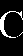

# Сегментация текста

## Алфавит - португальский

## Сегментация символов

### Исходное изображение

### Выделенные символы в строке

       
      
      
   

### Анализ

Алгоритм смог выделить отдельныебуквы из текста.

## Сегментация текстовой области

### Исходное изображение

### Сегментированное изображение

### Анализ

Алгоритм сегментации текстовой области хорошо выделил текст на основе профилей.
